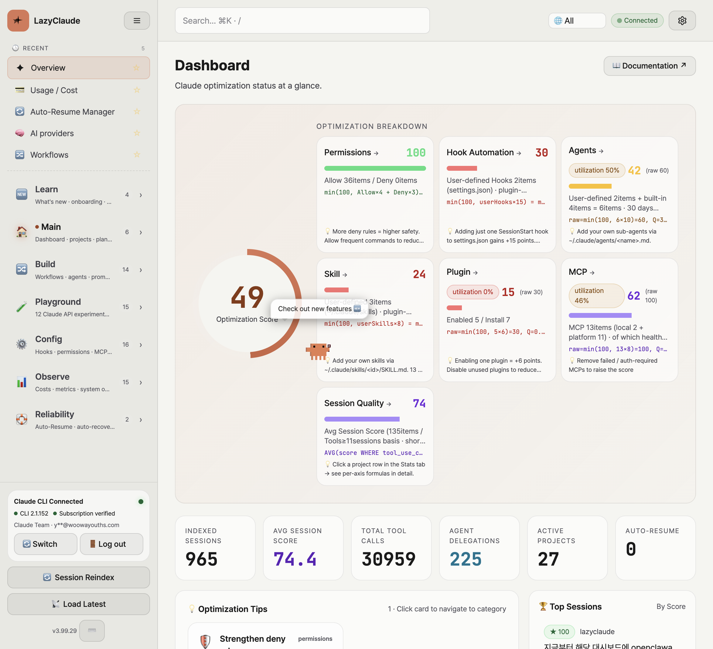
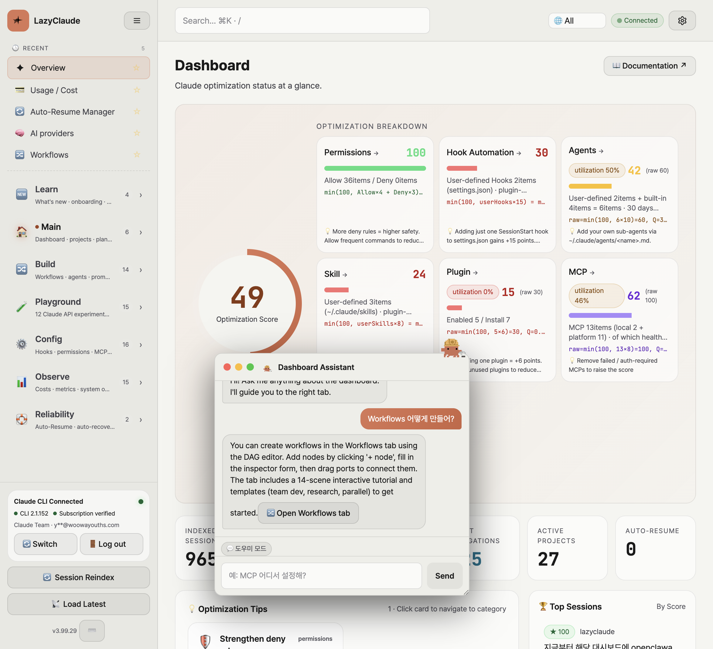
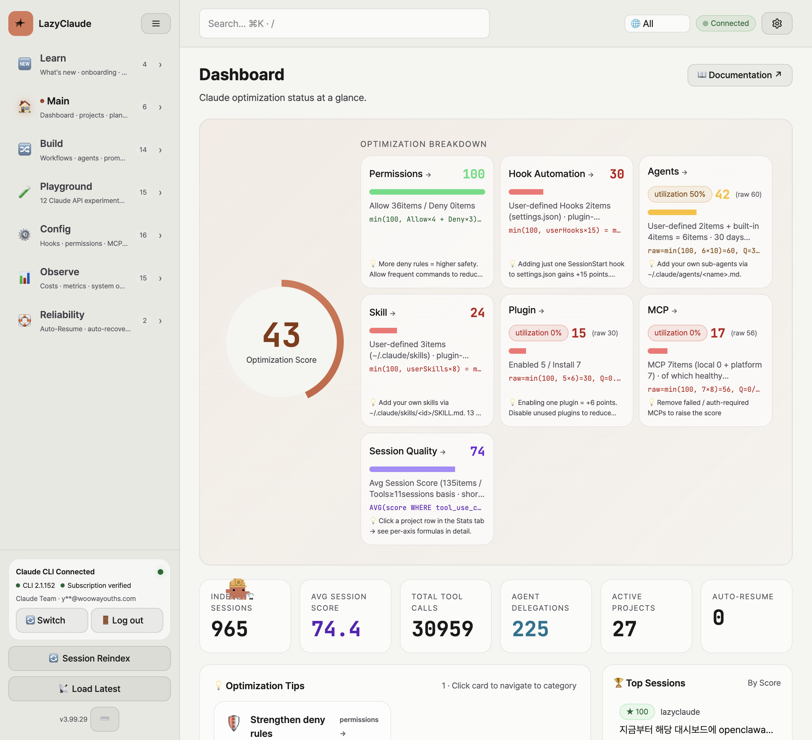
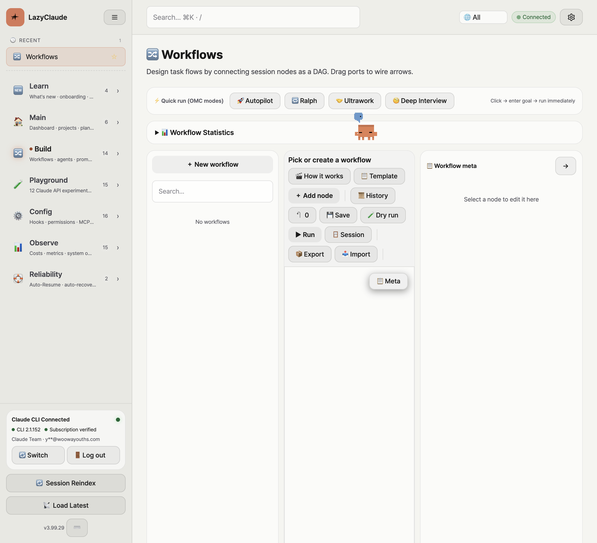
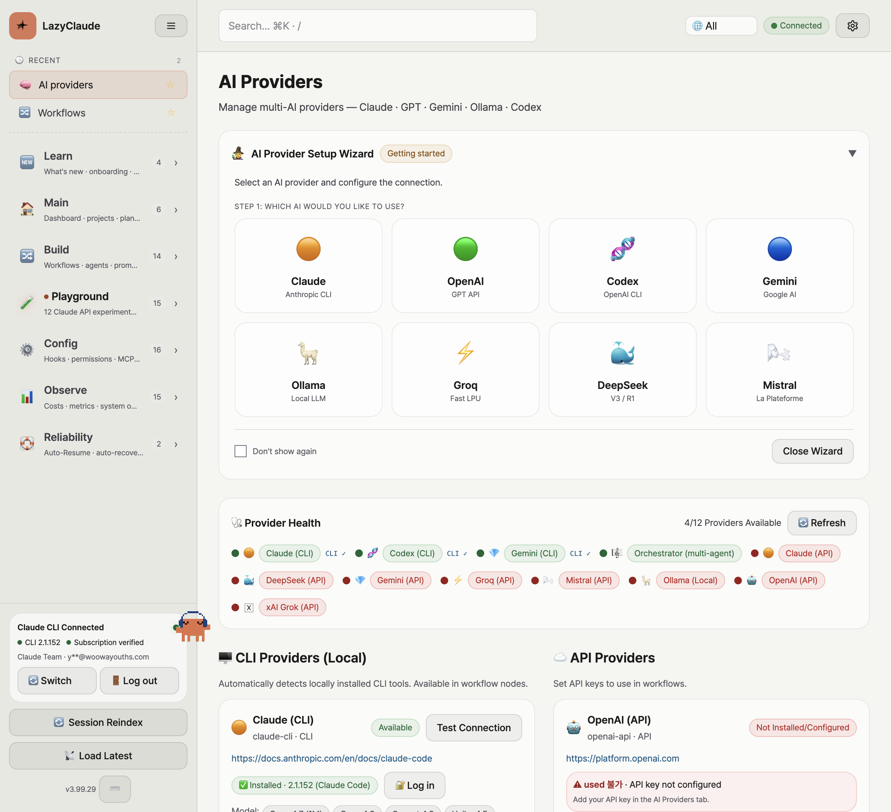
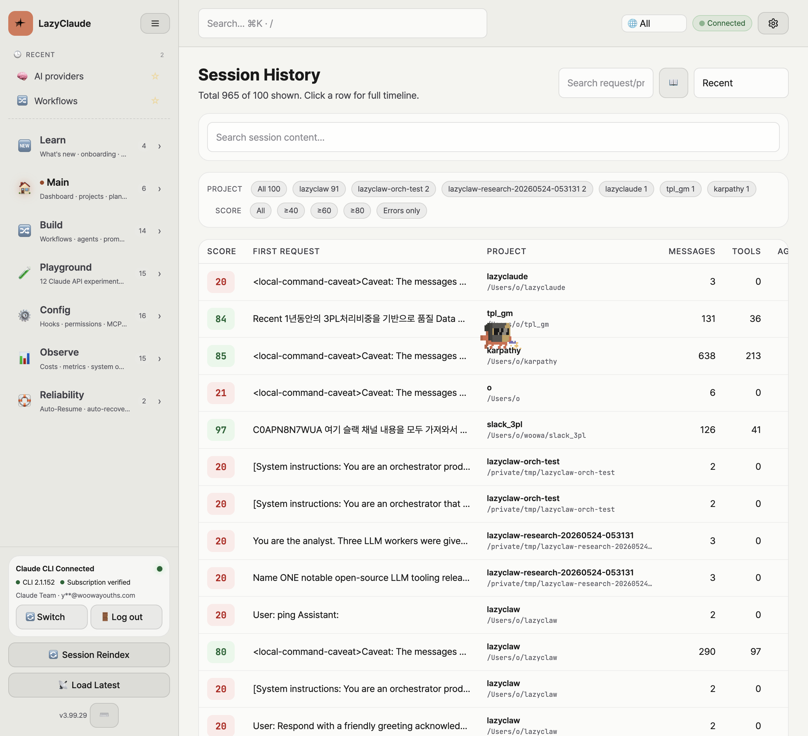
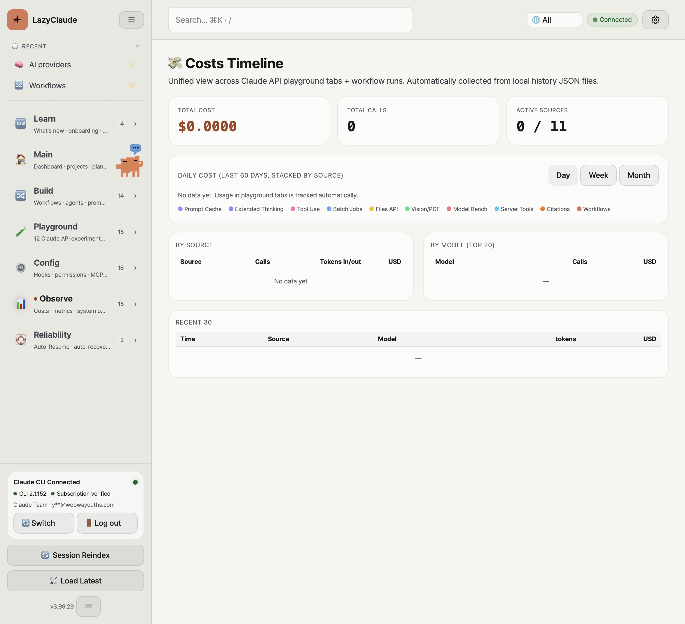
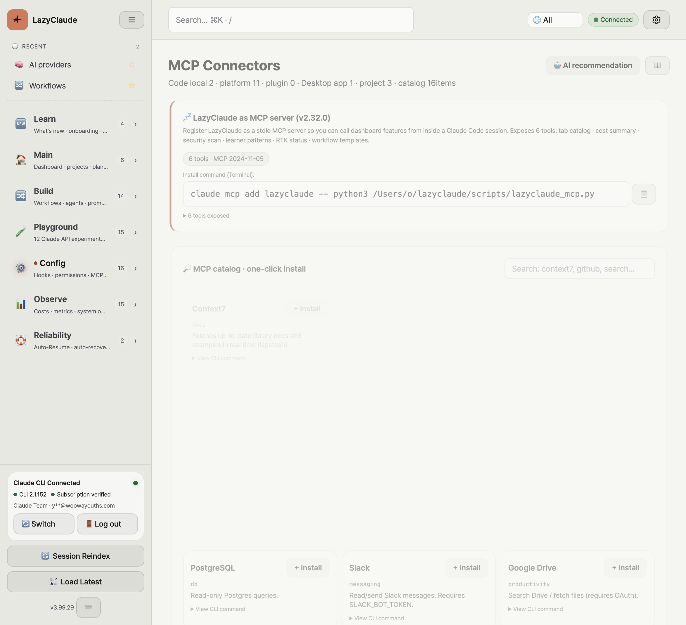
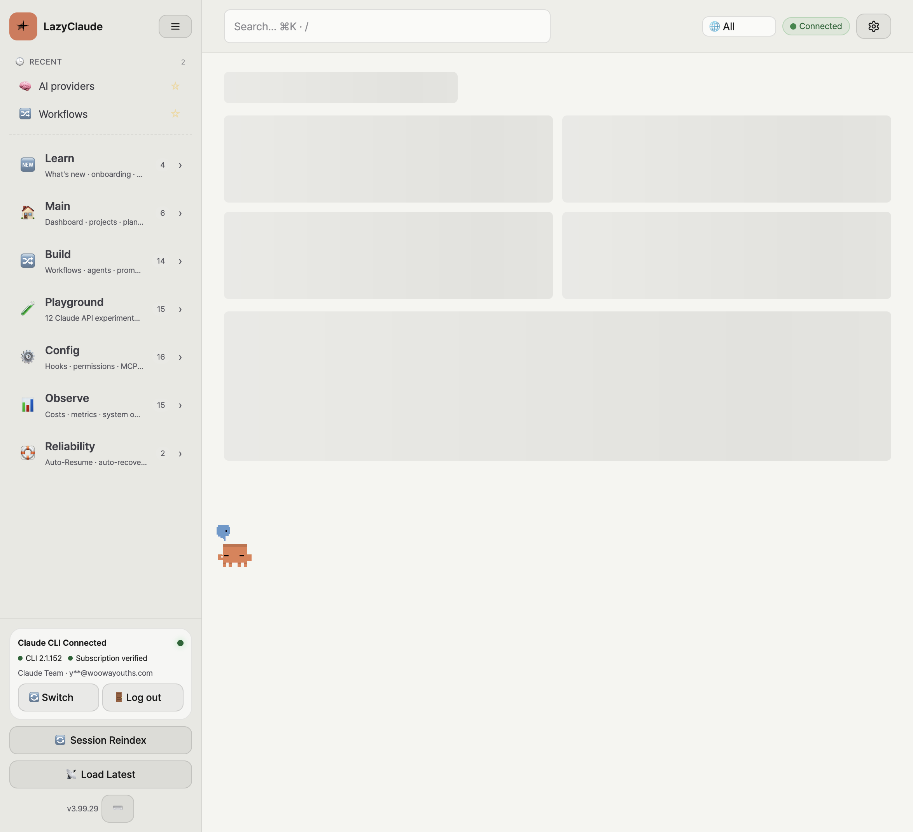

<div align="center">

# 💤 LazyClaude


**The lazy, elegant dashboard for everything Claude.**

_Don't memorize 50+ CLI commands. Just click._

[](./README.ko.md)
[](./README.zh.md)
[](https://www.python.org/downloads/)
[](./LICENSE)
[](./CHANGELOG.md)

</div>

LazyClaude is a **local-first command center** for your `~/.claude/` directory (agents, skills, hooks, plugins, MCP, sessions, projects) plus an n8n-style workflow engine. Everything ships behind one `python3 server.py` — Python stdlib, single-file HTML, no install step.

> ℹ️ The standalone terminal CLI `lazyclaw` now lives in its own repository: <https://github.com/cmblir/lazyclaw> (`npm i -g lazyclaw`).

**No cloud. No telemetry. No package to install.**

---

## 🚀 Quick start

```bash
git clone https://github.com/cmblir/LazyClaude.git
cd LazyClaude
python3 server.py
# → http://127.0.0.1:19500
```

Requires Python 3.10+ and Anthropic's `claude` CLI on `$PATH` (optional — the dashboard works without it; only Claude-bound features need it).

```bash
# Optional environment overrides
PORT=19500 python3 server.py
LOG_LEVEL=DEBUG python3 server.py
CLAUDE_HOME=/path/to/.claude python3 server.py
```

### macOS app (`.dmg`)

Prefer a double-click app over the terminal? Build a self-contained DMG:

```bash
make dmg
# → build/LazyClaude-<version>.dmg
```

The DMG ships `LazyClaude.app` with the project source bundled inside, so it runs without a separate checkout. It still uses the **system `python3`** (LazyClaude is stdlib-only — no Python runtime is bundled), so Python 3 must be installed (`xcode-select --install` or `brew install python3`).

Open the DMG → drag **LazyClaude.app** to **Applications** → launch it. The app starts the local server and opens `http://127.0.0.1:19500` in your browser; server logs go to `~/Library/Logs/LazyClaude/server.log`. Quit it from the Dock to stop the server.

> The app is **unsigned**, so the first launch needs **right-click → Open** (or `xattr -dr com.apple.quarantine /Applications/LazyClaude.app`) to get past Gatekeeper.

For local development you can instead use `make install-mac`, which installs a thin bundle that runs directly against your repo checkout (no bundled copy).

---

## � Screenshots

<table>
<tr><td align="center"><b>Overview</b><br/></td>
<td align="center"><b>Dashboard Assistant</b><br/></td>
</tr>
<tr><td align="center"><b>Dashboard</b><br/></td>
<td align="center"><b>Workflows</b><br/></td>
</tr>
<tr>
<td align="center"><b>AI Providers / Playground</b><br/></td>
<td align="center"><b>Sessions</b><br/></td>
</tr>
<tr>
<td align="center"><b>Cost Timeline</b><br/></td>
<td align="center"><b>MCP Servers</b><br/></td>
</tr>
<tr>
<td align="center" colspan="2"><b>Auto-Resume</b><br/></td>
</tr>
</table>

---

## �🔄 Auto-Resume with live TTY injection (v3.65.0+)

When a Claude session hits a rate-limit or selection prompt, Auto-Resume can now inject keystrokes into the **live terminal** — not just spawn a separate subprocess. macOS only:

- **Strategy A**: TTY-targeted AppleScript (iTerm, Terminal.app) — no focus shift
- **Strategy B**: System Events keystroke fallback (Warp, kitty, WezTerm, Alacritty, Ghostty, Hyper, Tabby, VS Code, Cursor) — direct `keystroke` typing (a programmatic Cmd+V paste is silently swallowed by Warp, so the clipboard path was dropped in v3.99.46)

Pass `pressChoice: "1"` (default) to dismiss `1) Continue / 2) Quit` selection prompts before injecting your prompt. Permission gate: System Events fallback requires Accessibility permission for python3 (granted once via System Settings → Privacy & Security → Accessibility).

```
POST /api/auto_resume/inject_live
{ "sessionId": "...", "prompt": "keep going", "pressChoice": "1" }
```

The default resume prompt is the short ASCII `keep going` (v3.99.46+) — the most reliable payload for live keystroke injection. Override it per binding in the UI prompt field or via `body.prompt`.

Time-based deadlines (`durationSec` / `deadlineMs`) replace the legacy `maxAttempts` cap — pick how long, not how many tries.

**Resume delay** (`resumeDelaySec`, v3.99.46+): by default the worker parses the reset moment from the cap message and resumes exactly then. Set a manual delay instead — resume N seconds after the limit hit (UI presets: 2h / 3h / custom hours).

---

## 📐 Architecture

```
LazyClaude/
├── server.py                  # entry — binds 127.0.0.1:19500 (override via PORT env)
├── server/                    # ~25 stdlib-only Python modules
│   ├── routes.py              # single dispatch table
│   ├── workflows.py           # DAG engine (ThreadPoolExecutor)
│   ├── ai_providers.py        # provider registry (claude/openai/gemini/ollama/...)
│   ├── auto_resume.py         # rate-limit retry loop with deadlineMs
│   ├── auto_resume_inject.py  # macOS live TTY injection (v3.65)
│   └── ...
├── dist/                      # single-file SPA (HTML + app.js + locales)
└── tests/  # pytest unit specs + Playwright E2E
```

### Data stores

| Path | Purpose | Override env |
|---|---|---|
| `~/.claude-dashboard.db` | SQLite — session index, costs, telemetry | `CLAUDE_DASHBOARD_DB` |
| `~/.claude-dashboard-workflows.json` | Workflows + runs + custom templates | `CLAUDE_DASHBOARD_WORKFLOWS` |
| `~/.claude-dashboard-ai-providers.json` | API keys, custom CLIs, fallback chain | `CLAUDE_DASHBOARD_AI_PROVIDERS` |
| `~/.claude-dashboard-auto-resume.json` | Auto-resume bindings | `CLAUDE_DASHBOARD_AUTO_RESUME` |
| `~/.claude/` | Claude Code's own state — read-only | `CLAUDE_HOME` |

All writes go through atomic `tmp + rename` (`server/utils.py::_safe_write`).

---

## 🌍 i18n

Korean is the source language. Every user-visible string passes through `t('한국어 원문')` and resolves via `dist/locales/{ko,en,zh}.json`. Run `make i18n-refresh` after adding new strings.

---

## 🛠️ Troubleshooting

**"port 19500 already in use"** — `server.py` auto-kills the prior occupant of `$PORT` before binding. If you'd rather pin a different port: `PORT=8080 python3 server.py`. The default moved from 8080 → 19500 in v3.99 because 8080 is a heavily-shared local-dev port (Tomcat / http-server / dozens of tutorials) and PWA install state from another project at that origin was hijacking the dashboard's "Open in app" button on shared machines. If you have existing scripts / shortcuts pointing at 8080, set `PORT=8080` to keep them working.

**"Open in app" launches some other application** — Chrome PWAs are scoped per-origin (`http://127.0.0.1:<port>`) so any PWA you previously installed on the same port hijacks the launch. Visit `chrome://apps`, remove any non-LazyClaude entry pointing at that port, then `chrome://settings/content/all` → search the port → "Delete data" to wipe the cached install state. The v3.99 manifest also sets an explicit `id` so Chrome treats this dashboard as its own app even when you have other localhost PWAs installed at the same origin.

**"command not found: claude"** — install [Claude Code](https://claude.com/claude-code). The dashboard's tabs that don't depend on `claude` (workflow editor, AI providers, MCP, etc.) work without it.

**Auto-Resume live injection silently failing** — on macOS, grant Accessibility permission to `python3` in System Settings → Privacy & Security → Accessibility. The dashboard surfaces error code `1002 / -1719` with a hint when it's missing.

**Toast 📋 button breaking with broken-HTML output** — fixed in v3.66.0.

---

## 🤝 Contributing

```bash
make i18n-refresh          # required after touching any t('...') strings
python3 -m pytest tests/   # Python suite
npx playwright test        # CLI/daemon suite
node scripts/e2e-dashboard-qa.mjs   # full dashboard probe
```

Branches: `feat/*`, `fix/*`, `chore/*`. Annotated tags only (`git tag -a vX.Y.Z -m "..."`). Don't push directly to `main` from a fork without review.

See [CHANGELOG.md](./CHANGELOG.md) for the full per-release log.

---

## Star History

<a href="https://www.star-history.com/?repos=cmblir/lazyclaude&type=date&legend=top-left">
 <picture>
   <source media="(prefers-color-scheme: dark)" srcset="https://api.star-history.com/chart?repos=cmblir/lazyclaude&type=date&theme=dark&legend=top-left" />
   <source media="(prefers-color-scheme: light)" srcset="https://api.star-history.com/chart?repos=cmblir/lazyclaude&type=date&legend=top-left" />
   
 </picture>
</a>

---

## 📝 License

[MIT](./LICENSE) — free for personal and commercial use.

---

## 🙏 Acknowledgements

- [Anthropic Claude Code](https://claude.com/claude-code) — the CLI this dashboard is built around
- [n8n](https://n8n.io) — workflow editor inspiration
- [lazygit](https://github.com/jesseduffield/lazygit) / [lazydocker](https://github.com/jesseduffield/lazydocker) — the "lazy" spirit

<div align="center"><sub>Made with 💤 for those who'd rather click than type.</sub></div>
